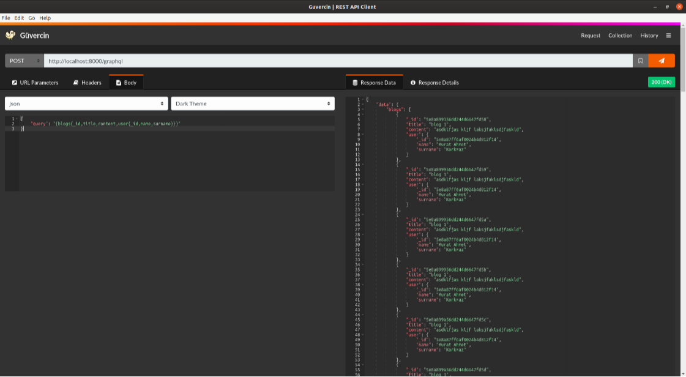

<h1 align="center">Welcome to simple-blog-api-with-graphql 👋</h1>
<p>
  
  <a href="#" target="_blank">
    
  </a>
</p>

> Simple blog api with graphql

### localhost:8000/graphql adresinden sorgu işlemleri yapabilirsiniz.

## Screenshot

<p align="center">
  

  
</p>

## Install

```sh
npm install
```

## Usage

```sh
npm start
```

## Author

👤 **Ahmet Korkmaz <muratahmetkorkmaz@hotmail.com>**

* Website: ahmetkorkmaz3.github.io
* Github: [@ahmetkorkmaz3](https://github.com/ahmetkorkmaz3)

## Show your support

Give a ⭐️ if this project helped you!

***
_This README was generated with ❤️ by [readme-md-generator](https://github.com/kefranabg/readme-md-generator)_