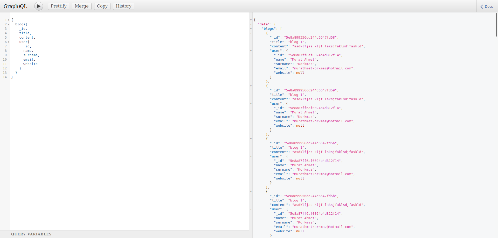

<h1 align="center">Welcome to simple-blog-api-with-graphql 👋</h1>
<p>
  
  <a href="#" target="_blank">
    
  </a>
</p>

> Simple blog api with graphql

### localhost:8000/graphql adresinden sorgu işlemleri yapabilirsiniz.

### Request atmak için localhost:8000/graphql endpoint'ine POST method, Content-Type: application/json ve body içerisinde "query" parametresi yollayarak yapabilirsiniz.

#### Example Request

- curl -XPOST -H "Content-type: application/json" -d '{"query": "{blogs{\_id,title,content,user{\_id,name,surname}}}"}' 'http://localhost:8000/graphql'

## Screenshot

<h1 align="center">
  
  
</h1>

## Install

```sh
npm install
```

## Usage

```sh
npm start
```

## Author

👤 **Ahmet Korkmaz <muratahmetkorkmaz@hotmail.com>**

- Website: [ahmetkorkmaz3.github.io](https://ahmetkorkmaz3.github.io)
- Github: [@ahmetkorkmaz3](https://github.com/ahmetkorkmaz3)

## Show your support

Give a ⭐️ if this project helped you!

---

_This README was generated with ❤️ by [readme-md-generator](https://github.com/kefranabg/readme-md-generator)_
